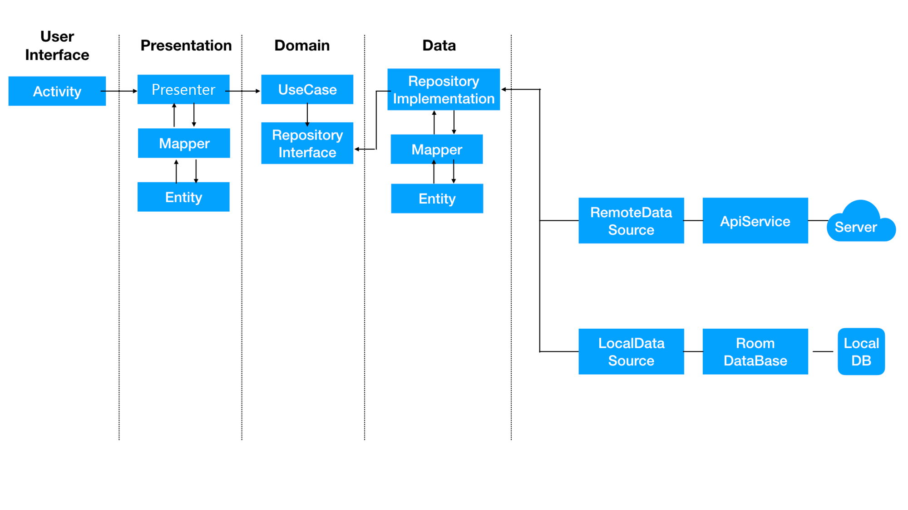

# Comfortment Android

""

# Using Library

* AndroidX
* Android Jetpack's Navigation
* Android Architecture Components's Room
* Dagger2 for dependency injection
* Rx Android 2 for reactive extensions for Android
* Rx Java 2 for reactive extensions for the JVM
* Retrofit2 for REST api communication
* Glide for image loading

# Architecture

아키텍처는 Clean Architecutre + MVP 를 사용했습니다.

**Clean Architecture**

**MVP(Model View Presenter)**

# Architecture Approach

아키텍처 흐름도 입니다.  

